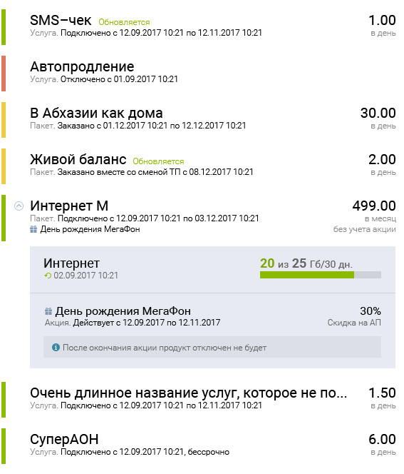

# Тестовое задание для компании «Peter-Service»

## Описание проекта

[Демо](https://cybersunt.github.io/peter-service/public) | [Техническое задание](Specification.md)

* **Используемые технологии**: HTML5, CSS3, JS(ES5)
* **Сетка:** Резиновая
* **Адаптив:** да
* **Автоматизация:** Gulp
* **Фреймворки:** Vue.js

* **HTML технологии:** ванильный HTML, разметка по БЭМ
* **CSS технологии:** ванильный СSS, для создания сеток использован **flexbox**
* **Vue.js**: генерация элементов DOM-дерева, обработка событий
* **SVG**: да

* **Доступность**:
    *  все картинки имеют подпись, если вдруг будут недоступны
    *  все интерактивные элеменеты доступны с клавиатуры
