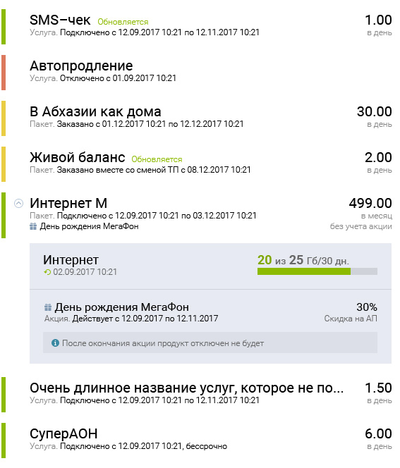

# Задача

Квалификационная задача от Peter-Service

---

## В каком виде предоставить результат работы:

Либо ссылка на любой хостинг, либо архив, содержимое которого можно будет изучить, открыв его в браузере без конфигурирования локального сервера.

## Требования:

* Поддержка браузеров: IE11 и Chrome;
* Использование БЭМ;
* Подключение любой js-библиотеки на ваш выбор, кроме Jquery;
* Продемонстрировать знание js не только в части сворачивания и разворачивания элементов, но и, например, в части вывода одинаковых сущностей с помощью цикла, а не copy-paste способом.

## Описание задачи:

На макете-исходнике представлена часть формы для работы с продуктами абонента. Данный блок необходимо сверстать с минимальной шириной 550 px и максимальной 750 px.

Цветными вертикальными блоками обозначаются текущие статусы продуктов.
Далее следует наименование продукта, рядом с которым может быть признак его обновления. На второй строке, под наименованием, находится описание продукта.
Обе строчки (наименование и описание) не должны переносится, необходимо предусмотреть урезание в многоточие, если они не поместились, например, как показано в продукте **«Очень длинное название…»**. Если на строке находится длинное название и признак обновления, то слово **«Обновляется»** должно быть видно, наименование необходимо обрезать в многоточие с учетом присутствия в строке этого признака.

В правой части выводятся абонентская плата и период ее списания.
Этот блок выровнен вправо и занимает ширину, равную его контенту.

Кроме того, есть сложный продукт **«Интернет М»**, который может сворачиваться.
В свернутом виде исчезает серый блок с подробностями, и иконка вертикально разворачивается.
Expand и collapse происходят по клику на саму иконку и на заголовок.

**_В сером блоке с подробной информацией размещаются:_**

Наименование продукта, дата обновления, а в правой его части – индикатор потребления продукта.
В нижней части размещена информация по акции к продукту, срок ее действия, а в правой - значение акции (30%-ая скидка на АП), ниже находится инфоблок с дополнительной информацией по акции.
